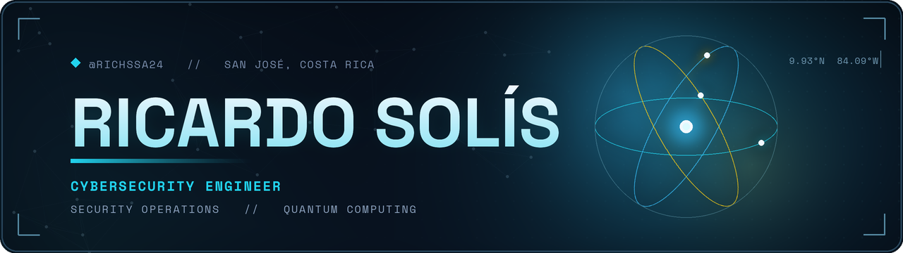

<p align="center">
  
</p>

<h3 align="center">🐢</h3>

<p align="center">
  
</p>

<p align="center">
  
  &nbsp;
  
  &nbsp;
  
  &nbsp;
  
</p>

<br>

> 🐢 **Why the turtle?** Because it's the original blue-teamer. Hard shell, layered defense, zero panic, and it always outlasts the hare. Everything I build follows the same doctrine: harden the shell, watch everything, move deliberately, win the long game.

<br>

Cybersecurity engineering student in Costa Rica, one semester from the finish line. I like taking systems apart to find exactly where they break — then building the thing that catches whoever tries it next. Headed for the **SOC / blue-team** world, and lately falling hard down the **quantum computing** rabbit hole because the math is gorgeous and slightly terrifying.

I build a lot, lift heavy, and ship things that actually work.

<br>

<h2>🐢 the shell collection <sub><sup>(what i'm building)</sup></sub></h2>

<table>
<tr>
<td width="50%" valign="top">

### 🛡️ [SENTINEL-LINUX 2.0](https://github.com/RichSsa24/Sentinel_Linux2.0)


My main thing. A security-monitoring framework that watches Linux boxes like a SOC analyst who never blinks — detecting threats, correlating logs, and mapping everything to **MITRE ATT&CK** so an alert tells you what an attacker was *actually* trying to do, not just that something happened.

Like a turtle: it never rushes, it never sleeps, and nothing gets past the shell.

<p>
  
  
  
  
</p>

</td>
<td width="50%" valign="top">

### ⚛️ Quantum Optimization Lab


Where my curiosity is currently living. Hands-on experiments with **QAOA** and **QUBO/Ising** formulations for real optimization problems — backed by QWorld's Open Quantum Institute training and a spot in a CERN OQI quantum hackathon.

Turns out superposition and a turtle have something in common: both are in no hurry, and both get there anyway.

<p>
  
  
  
  
</p>

</td>
</tr>
</table>

<p align="center"><sub>🐢 More on the way — the lab is never empty.</sub></p>

<br>

<h2>🐢 currently crawling toward</h2>

```text
[████████████░░░░░░░░]  ISC2 Certified in Cybersecurity (CC)   → grinding
[██████████████░░░░░░]  Quantum optimization w/ Qiskit + QAOA  → experimenting
[████████████████████]  SOC / blue-team detection reflexes     → muscle memory
```

- 🎯 Grinding toward the **ISC2 Certified in Cybersecurity (CC)**
- ⚛️ Running quantum optimization experiments with **Qiskit** and **QAOA**
- 🔵 Sharpening SOC / blue-team detection until it's muscle memory

<br>

<h2>🐢 the stack <sub><sup>(a turtle is only as good as its shell)</sup></sub></h2>

<p align="center">
  
</p>

<details>
<summary><b>🐢 open the shell — full toolset inside</b></summary>

<br>

| Layer | Tools |
|---|---|
| 🛡️ **Security** | Nmap · Nessus · Snort IDS/IPS · Burp Suite · Metasploit · OWASP ZAP |
| 🌐 **Networking** | Cisco IOS · TCP/IP · OSPF · VLANs · ACLs · VPN · NAT |
| 🖥️ **Systems** | RHEL · Ubuntu · CentOS · Windows Server · Active Directory |
| 📋 **Frameworks** | MITRE ATT&CK · NIST CSF · CIS Controls · OWASP Top 10 |
| ⚛️ **Quantum** | Qiskit · QAOA · QUBO / Ising · D-Wave (dimod) |

</details>

<br>

<h2>🐢 certifications <sub><sup>(scutes on the shell — each one earned)</sup></sub></h2>

<p align="center">
  
</p>
<p align="center">
  
  
  
</p>
<p align="center">
  
  
</p>
<p align="center">
  
</p>

<br>

<h2>🐢 off the clock</h2>

When I'm not staring at logs, you'll find me:

- 🏋️ Under a barbell — competitive **powerlifter**, chasing heavier numbers, no days off *(yes, a turtle that deadlifts)*
- 💻 Coding a new tool

<br>

<h2>🐢 the numbers <sub><sup>(a turtle counts its steps)</sup></sub></h2>

<p align="center">
  
  &nbsp;
  
</p>

<p align="center">
  
</p>

<p align="center">
  <picture>
    <source media="(prefers-color-scheme: dark)" srcset="https://raw.githubusercontent.com/RichSsa24/RichSsa24/output/snake-dark.svg" />
    <source media="(prefers-color-scheme: light)" srcset="https://raw.githubusercontent.com/RichSsa24/RichSsa24/output/snake.svg" />
    
  </picture>
</p>

<sub align="center">🐢 vs 🐍 — the snake eats my commits, the turtle keeps making them.</sub>

<br>
<br>

<h2>🐢 say hi <sub><sup>(the turtle answers, eventually — usually fast)</sup></sub></h2>

<p align="center">
  <a href="https://www.linkedin.com/in/ricardo-solis-arias-3a382628a/">
    
  </a>
  <a href="mailto:ricardo02solis@gmail.com">
    
  </a>
  <a href="https://github.com/RichSsa24">
    
  </a>
</p>

<br>

<p align="center">
  
</p>
